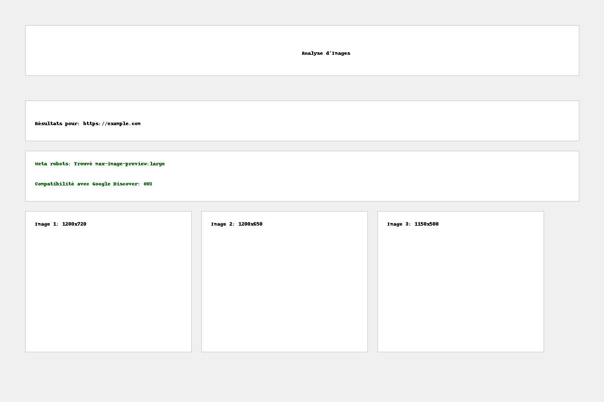

# Analyseur d'Images pour Google Discover

Cette application web permet d'analyser les images d'une page web pour vérifier leur compatibilité avec Google Discover.

## Fonctionnalités

- Détection du tag meta robots avec `max-image-preview:large`
- Analyse des images statiques et dynamiques
- Identification des 3 plus grandes images
- Vérification de la compatibilité avec Google Discover (images d'au moins 1200px de large)
- API REST pour intégration avec d'autres applications
- Indicateur de progression visuel pendant l'analyse
- Journalisation complète des opérations dans un fichier de logs
- Mécanisme de tentatives multiples pour l'analyse dynamique
- Interface utilisateur moderne avec affichage en grille des images détectées

## Captures d'écran

### Page d'accueil


### Page de résultats


## Technologies utilisées

- Flask
- BeautifulSoup
- Pillow
- Playwright
- Docker

## Installation

### Avec Docker

1. Cloner le dépôt
```bash
git clone [URL_DU_DEPOT]
cd [NOM_DU_DOSSIER]
```

2. Construire l'image Docker
```bash
docker build -t image-analysis-api .
```

3. Exécuter le conteneur
```bash
docker run -p 5001:5001 image-analysis-api
```

4. Accéder à l'application
```
http://localhost:5001
```

### Sans Docker

1. Cloner le dépôt
```bash
git clone [URL_DU_DEPOT]
cd [NOM_DU_DOSSIER]
```

2. Installer les dépendances
```bash
pip install -r requirements.txt
```

3. Installer Playwright
```bash
playwright install --with-deps chromium
```

4. Exécuter l'application
```bash
python app.py
```

5. Accéder à l'application
```
http://localhost:5001
```

## Utilisation

1. Ouvrez l'application dans votre navigateur
2. Entrez l'URL de la page web à analyser
3. Cliquez sur "Analyser"
4. Consultez les résultats :
   - Statut du tag meta robots
   - Compatibilité avec Google Discover
   - Liste des 3 plus grandes images avec dimensions et aperçus

## API REST

L'application propose une API REST pour l'intégration avec d'autres services.

### Endpoint

`POST /api/analyze`

### Exemple de requête

```bash
curl -X POST \
  http://localhost:5001/api/analyze \
  -H 'Content-Type: application/json' \
  -d '{"url": "https://www.example.com"}'
```

### Exemple de réponse

```json
{
  "url": "https://www.example.com",
  "robots_meta": {
    "max_image_preview_large_found": true,
    "found_in_static": true,
    "found_in_dynamic": false
  },
  "discover_compatibility": {
    "has_large_images": false,
    "minimum_width_required": 1200,
    "compatible": false
  },
  "largest_images": [
    {
      "url": "https://www.example.com/image1.jpg",
      "width": 800,
      "height": 600,
      "static": true,
      "dynamic": false,
      "area": 480000
    }
  ]
}
``` 