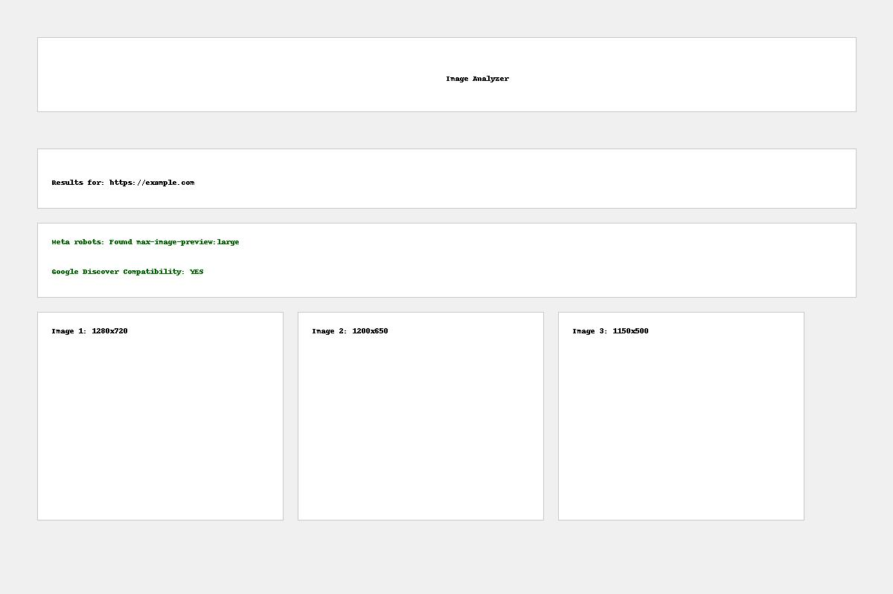

# Image Analyzer for Google Discover

This web application allows you to analyze images on a web page to check their compatibility with Google Discover.

## Features

- Detection of meta robots tag with `max-image-preview:large`
- Analysis of static and dynamic images
- Identification of the 3 largest images
- Verification of compatibility with Google Discover (images at least 1200px wide)
- REST API for integration with other applications
- Visual progress indicator during analysis
- Complete logging of operations in a log file
- Multiple retry mechanism for dynamic analysis
- Modern user interface with grid display of detected images

## Screenshots

### Home Page


### Results Page


## Technologies Used

- Flask
- BeautifulSoup
- Pillow
- Playwright
- Docker

## Installation

### With Docker

1. Clone the repository
```bash
git clone [REPOSITORY_URL]
cd [FOLDER_NAME]
```

2. Build the Docker image
```bash
docker build -t image-analysis-api .
```

3. Run the container
```bash
docker run -p 5001:5001 image-analysis-api
```

4. Access the application
```
http://localhost:5001
```

### Without Docker

1. Clone the repository
```bash
git clone [REPOSITORY_URL]
cd [FOLDER_NAME]
```

2. Install dependencies
```bash
pip install -r requirements.txt
```

3. Install Playwright
```bash
playwright install --with-deps chromium
```

4. Run the application
```bash
python app.py
```

5. Access the application
```
http://localhost:5001
```

## Usage

1. Open the application in your browser
2. Enter the URL of the web page to analyze
3. Click on "Analyze"
4. Check the results:
   - Status of the meta robots tag
   - Compatibility with Google Discover
   - List of the 3 largest images with dimensions and previews

## REST API

The application provides a REST API for integration with other services.

### Endpoint

`POST /api/analyze`

### Request Example

```bash
curl -X POST \
  http://localhost:5001/api/analyze \
  -H 'Content-Type: application/json' \
  -d '{"url": "https://www.example.com"}'
```

### Response Example

```json
{
  "url": "https://www.example.com",
  "robots_meta": {
    "max_image_preview_large_found": true,
    "found_in_static": true,
    "found_in_dynamic": false
  },
  "discover_compatibility": {
    "has_large_images": false,
    "minimum_width_required": 1200,
    "compatible": false
  },
  "largest_images": [
    {
      "url": "https://www.example.com/image1.jpg",
      "width": 800,
      "height": 600,
      "static": true,
      "dynamic": false,
      "area": 480000
    }
  ]
}
``` 